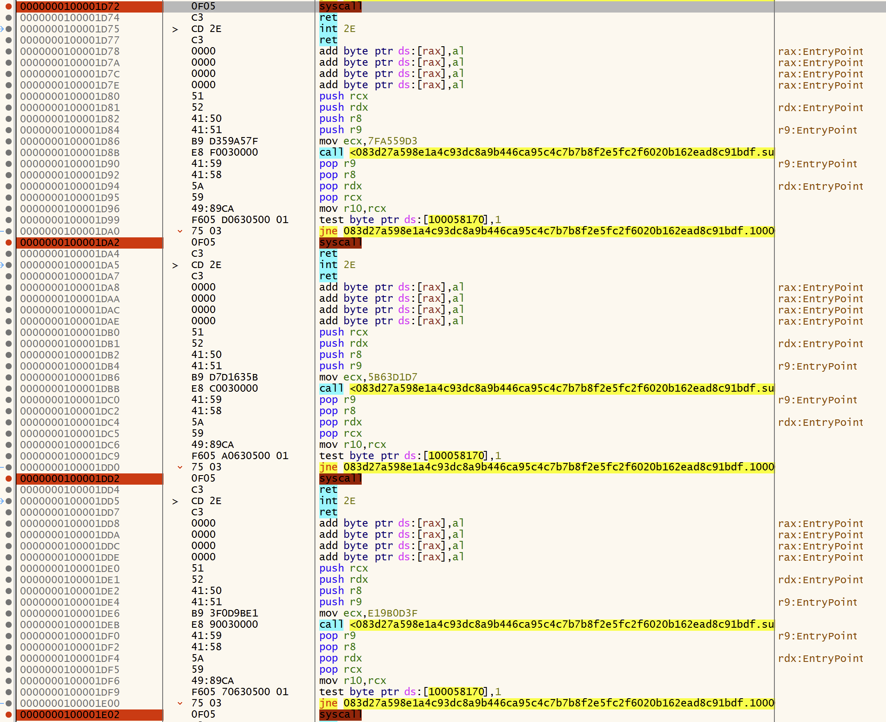

Analysis of a second stage packed Cobalt Strike beacon loader that did the rounds a while ago, good one for learning about direct syscalls.

## Overview ##

### Sample ###

`083d27a598e1a4c93dc8a9b446ca95c4c7b7b8f2e5fc2f6020b162ead8c91bdf`

* [Malshare](https://malshare.com/sample.php?action=detail&hash=083d27a598e1a4c93dc8a9b446ca95c4c7b7b8f2e5fc2f6020b162ead8c91bdf)
* [VirusTotal](https://malshare.com/sample.php?action=detail&hash=083d27a598e1a4c93dc8a9b446ca95c4c7b7b8f2e5fc2f6020b162ead8c91bdf)

### Tools ###

* [Didier Stevens CS Tools](https://blog.didierstevens.com/programs/cobalt-strike-tools/)
* [SentinelOne CS Parser](https://github.com/Sentinel-One/CobaltStrikeParser)
* [x64dbg](https://x64dbg.com)
* [Ghidra](https://ghidra-sre.org)

### References ###

* [MSDN - ZwAllocateVirtualMemory](https://learn.microsoft.com/en-us/windows-hardware/drivers/ddi/ntifs/nf-ntifs-zwallocatevirtualmemory)
* [64-bit Calling Convention](https://www.ired.team/miscellaneous-reversing-forensics/windows-kernel-internals/windows-x64-calling-convention-stack-frame)

## Unpacking CS ##

Running the bin through the [SentinelOne CS Parser](https://github.com/Sentinel-One/CobaltStrikeParser) gives us nothing and closer inspection of the file in HxD shows it's actually a valid PE file, the CS payload must be extracted/injected at runtime.

Taking a look at the PE file in the debugger we notice a bunch direct syscalls used to avoid API monitoring, this is a huge red-flag (literally!) as a legitimate program would not be making syscalls directly.

In the disassembler we only see some of the syscalls noted in the debugger, the dissembler probably hasn't dissembled them correctly. To uncover further syscalls we can pattern match the repeating 4-bytes between functions that contain both the syscall and prior instruction. To do this we highlight the instructions we want to match and use `Search > For Instruction Patterns`. 

Now we've found potential additional syscalls we can scroll to the start of the function where the null-bytes end and dissemble the bytecode using `D`.

Inside the functions containing the syscalls there is a call to an API hashing function located in `FUN_100002189 > FUN_100001fa0` used to decode and dynamically lookup the syscall service number (SSN) before calling.

Since we captured the addresses of the syscalls statically we can set breakpoints in the debugger to identify what these API calls are. Giving us the following interesting API calls which are most likely used to write and change the permissions to a section of memory: 

* ZwAllocateVirtualMemory
* ZwProtectVirtualMemory
* ZwWriteVirtualMemory

Looking up [ZwAllocateVirtualMemory](https://learn.microsoft.com/en-us/windows-hardware/drivers/ddi/ntifs/nf-ntifs-zwallocatevirtualmemory) & ZwProtectVirtualMemory on MSDN we can see that the second argument stored in RDX (due to the [64-bit calling convention](https://www.ired.team/miscellaneous-reversing-forensics/windows-kernel-internals/windows-x64-calling-convention-stack-frame)) is a pointer to an address that will receive the base address of the allocated region (as this is 64-bit the address will be 8 bytes long). 

Following this address from the dump view into the memory map allows us to dump the payload before it's mapped and executed.
 

Looks like the payload was decrypted into the middle of the `.text` section of the original PE file. Notice that the header of the MZ file is odd, looks like a reflective PE header - let's remove the garage before it and take a look.

## Extracting Configuration ##

Finally let's run the dumped binary through the [SentinelOne CS Parser](https://github.com/Sentinel-One/CobaltStrikeParser), we can see the Cobalt Strike Beacon configuration now!

